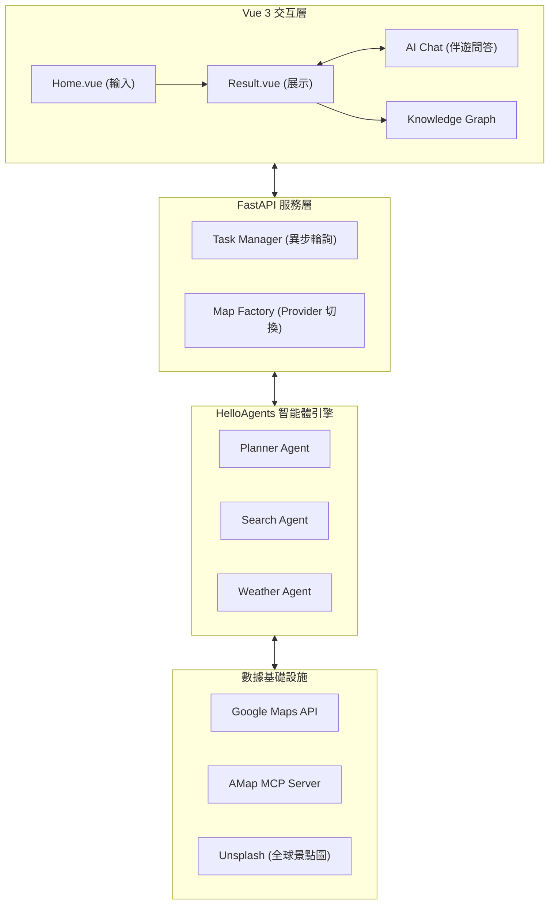

# 旅途星辰 (TripStar) - 全球化 AI 旅行智能体

> **基於 HelloAgents 框架打造的多智能體協作文旅規劃平台**

<p align="center">
  
  
  
  
  
</p>

## 🌟 項目簡介

**旅途星辰 (TripStar)** 是一款面向全球旅行者的 AI 智慧行程規劃平台。不同於傳統的靜態攻略，TripStar 採用 **多智能體 (Multi-Agent) 協作架構**，模擬人類旅行管家的思考邏輯。

通過簡單的自然語言交互，TripStar 能自動調用全球地圖數據、天氣服務、酒店資源，為用戶定制包含預算明細、逐日行程、路徑規劃及知識圖譜在內的深度旅行方案。

---

## 🚀 核心亮點

### 1. 🌍 雙地圖引擎 (Map Agnostic) - **v0.3.0 NEW**
採用抽象化地圖服務架構，可根據需求一鍵切換：
*   **Google Maps 模式**：賦能全球規劃，支持 WGS-84 座標、Places 全球搜尋及路徑導航。
*   **高德地圖 (AMap) 模式**：深度優化中國大陸數據，支持精確 POI 搜尋及真實道路路徑規劃。

### 2. 🤖 多智能體協作流 (Agentic Workflow)
內置四類專業 Agent，通過工作流協同：
*   **景點規劃專家**：負責 POI 檢索與遊玩時序優化。
*   **天氣管家**：提供精確到日的氣候預報與穿衣建議。
*   **酒宿推薦員**：基於景點位置與預算篩選高性價比住所。
*   **行程總控**：整合碎片數據，生成結構化路書。

### 3. 🌐 深度本地化與多語言
*   **全面支持繁體中文**：針對台灣用戶優化了語言習慣（zh-TW）、貨幣及地理描述。
*   **多語言切換**：已適配 简体中文、繁體中文、日本語、English。

### 4. 💎 沉浸式視覺與交互
*   **奢華暗黑玻璃擬物風**：採用最新的玻璃擬物化 (Glassmorphism) UI 語言。
*   **交互式知識圖譜**：將行程邏輯視覺化，直觀展示城市與景點的關聯。
*   **伴遊 AI 彈窗**：行程生成後，AI 助手擁有完整記憶，隨時回答用戶對行程細節的追問。

---

## 🏗️ 系統架構



---

## ⚙️ 環境變量矩陣

為了支持雙地圖切換，請在 `.env` 中根據需求配置：

| 變量名 | 描述 | 示例值 |
| :--- | :--- | :--- |
| `MAP_PROVIDER` | 地圖供應商 | `google` 或 `amap` |
| `LLM_API_KEY` | 大模型 API Key | `sk-xxxx` |
| `GOOGLE_MAPS_API_KEY` | Google Maps API 密鑰 | `AIzaSy...` |
| `VITE_AMAP_WEB_KEY` | 高德 Web 服務 Key | `xxxx` (後端用) |
| `VITE_AMAP_WEB_JS_KEY`| 高德 JS API Key | `xxxx` (前端用) |
| `UNSPLASH_ACCESS_KEY` | Unsplash 圖片 Key | `xxxx` |

---

## 🛠️ 快速開始

### 1. 後端啟動 (Python 3.10+)
```bash
cd backend
python -m venv venv
source venv/bin/activate # Windows: venv\Scripts\activate
pip install -r requirements.txt
cp .env.example .env     # 修改 MAP_PROVIDER 和對應 Key
uvicorn app.api.main:app --reload
```

### 2. 前端啟動 (Node 18+)
```bash
cd frontend
npm install
# 配置 .env 中的 VITE_MAP_PROVIDER
npm run dev
```

---

## 🆕 最近更新
- **v0.3.0**: **架構級升級！** 接入 Google Maps 全球服務，支持全球範圍 POI 檢索與路徑規劃。
- **v0.2.5**: 優化 Unsplash 全球景點圖片匹配算法，Google 模式下支持英文精準搜索。
- **v0.2.1**: 新增對 **台灣繁體中文 (zh-TW)** 的全面支持及 UI 適配。

## 🤝 致謝與貢獻
感謝 [HelloAgents](https://github.com/google/hello-agents) 提供的多智能體框架支持。
歡迎提交 Issue 或 Pull Request 來幫助 TripStar 變得更好！

## 📄 授權說明
本项目採用 **GNU General Public License v2.0 (GPL-2.0)** 授權。

**Copyright (c) 2024 1sdv.**  
**Copyright (c) 2024-2026 alingowangxr.**

本項目是基於 [1sdv/TripStar](https://github.com/1sdv/TripStar) 的分叉版本（Fork），並在原項目的基礎上進行了功能擴展（如 Google Maps 整合、多語言優化等）。

本程序是自由軟件：您可以根據自由軟件基金會發佈的 GNU 通用公共許可證（許可證的第 2 版或之後的任何版本）的條款重新分發它和/或修改它。

發佈本程序的目的是希望它有用，但**不作任何擔保**；甚至沒有對**適銷性**或**特定用途適用性**的暗示擔保。詳見 [LICENSE](./LICENSE) 文件。

---
**旅途星辰 (TripStar)** - *讓每一場旅行都閃耀如星辰。*
